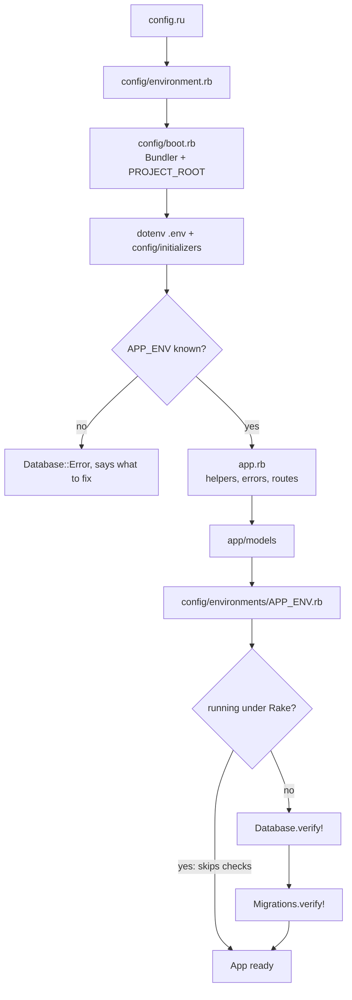

# Architecture

How the server boots and how a request travels through it. The entities are in
[resources/](resources/) and the error contract in [errors.md](errors.md).

## Layout

| Path | Responsibility |
| --- | --- |
| `config.ru` | Rack entry point: loads the environment, runs `App` |
| `config/boot.rb` | Bundler and gems; defines `PROJECT_ROOT` |
| `config/environment.rb` | Validates `APP_ENV`, loads app, models and settings, verifies the database |
| `config/initializers/` | Database connection and migration checks |
| `config/environments/*.rb` | Settings per environment |
| `app.rb` | Sinatra app: helpers, error handlers, health route, loads the routes |
| `app/routes/*.rb` | One file per resource |
| `app/models/*.rb` | ActiveRecord: validations, response allowlists, transitions |
| `app/helpers/*.rb` | JSON body, query parameters, record lookup and persistence |
| `lib/errors/errors.rb` | 404 / 405 / 500 handlers |
| `db/migrate/` | Schema, one migration per table |
| `spec/` | Unit specs (models) and request specs (routes) |
| `contract/` | Machine-readable contracts: `openapi.yml` and `database.sql` |

## Boot

- `APP_ENV` selects environment, settings and database (`development`,
  `test` or `production`); an unknown value stops the boot with the fix in the
  message.
- The database checks are skipped under Rake so `rake db:migrate` can run
  against a database that does not exist yet — the very case it fixes.
- `config.ru` prints startup errors (`Database::Error`, `Migrations::Error`)
  on their own, without a stack trace.

## Request lifecycle

In order, top to bottom. What each stage answers with lives in
[errors.md](errors.md).

| Stage | File |
| --- | --- |
| Body: size and JSON shape | `app/helpers/json.rb` |
| Fields: allowlist of the resource | `app/helpers/records.rb` |
| Query parameters: pagination, sorting, filters | `app/helpers/params.rb` |
| Lookup: id format, then record | `app/helpers/records.rb` |
| Persistence: validations, unique index | `app/helpers/records.rb` |
| Response: model's `as_json` allowlist | `app/models/*.rb` |

Anything that escapes reaches the handlers in `lib/errors/errors.rb`.

## Environments and server

- `development`, `test`, `production` — each with its own SQLite file in
  `storage/`, selected by `APP_ENV` (`.env`, see `.env.example`).
- Puma binds `127.0.0.1:9292` (`config/puma.rb`). The API has no
  authentication; the loopback address is the only thing keeping it private.
