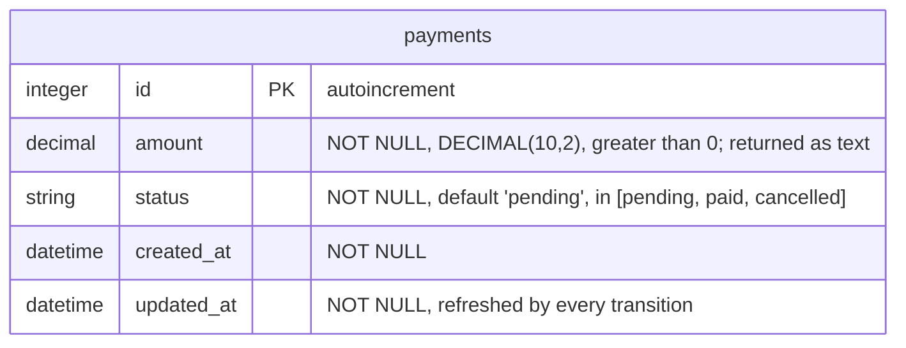
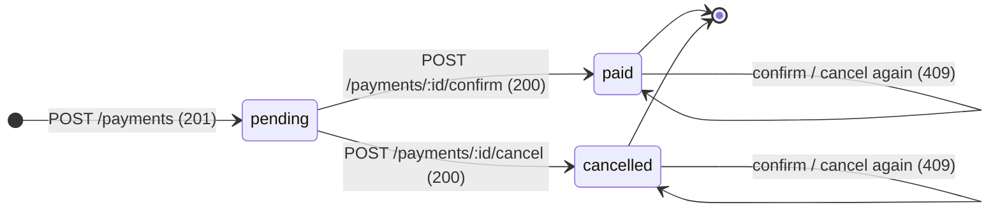
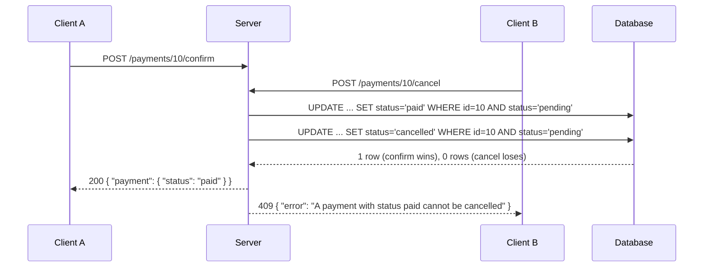

# Payment — Lifecycle

States, actions, transitions, headers and idempotency.

Source: [`app/routes/payments.rb`](../../app/routes/payments.rb) · [`app/models/payment.rb`](../../app/models/payment.rb) · [`db/migrate/20261001120002_create_payments.rb`](../../db/migrate/20261001120002_create_payments.rb)

## Schema



`amount` is **text on the wire**, like `Product::price`: sent as a JSON string
or number, always returned as a string (`"99.9"`).

### Accepted fields

`POST /payments` accepts **only** `amount`. `status` is server-owned: it is not
accepted from the client, not even as `null` — the server assigns `pending` on
creation. Unknown keys are a `400` (`Unknown fields`).

## States and transitions

A payment is born `pending` and may leave it exactly once, through one of two
actions. `paid` and `cancelled` are final — there is no transition out of them,
and none between them.



### Atomicity

`Payment.transition!(id, to:, from:)` puts the expected current state **inside
the UPDATE**:

```sql
UPDATE payments SET status = 'paid' WHERE id = ? AND status = 'pending'
```

Of two concurrent transitions on the same payment, exactly one matches the row
and wins; the other updates nothing and answers `409`. No lock, no
read-then-write race:



### Idempotency

The actions are **not** idempotent: repeating a confirm (or a cancel) on a
payment that already left `pending` answers `409`, because the second request
changes nothing and the client must learn the first one already won. `GET`
stays idempotent — repeating it leaves nothing to change.

## Routes

| Method | Path | Success | Notes |
| --- | --- | --- | --- |
| `POST` | `/payments` | `201` | `Location: /payments/:id`; status is always `pending` |
| `GET` | `/payments` | `200` | `{ "payments": [...] }`, optionally filtered by `?status=` (`pending`, `paid`, `cancelled`; anything else is `400`) |
| `GET` | `/payments/:id` | `200` | `{ "payment": {...} }` |
| `POST` | `/payments/:id/confirm` | `200` | `pending → paid`; no body, no `Content-Type` needed |
| `POST` | `/payments/:id/cancel` | `200` | `pending → cancelled`; no body, no `Content-Type` needed |

Entity-specific code beyond the shared ones (defined in
[`contract/openapi.yml`](../../contract/openapi.yml)): `409` when the payment
is no longer `pending`.

## Examples

### Create

```http
POST /payments
Content-Type: application/json

{ "amount": "99.9" }
```

```http
HTTP/1.1 201 Created
Location: /payments/10
Content-Type: application/json

{
  "payment": {
    "id": 10,
    "amount": "99.9",
    "status": "pending",
    "created_at": "2026-10-03T21:22:40.983Z",
    "updated_at": "2026-10-03T21:22:40.983Z"
  }
}
```

Sending `status` in the body is a `400` (`Unknown field: status`).

### List filtered by state

```http
GET /payments?status=pending
```

```http
HTTP/1.1 200 OK
Content-Type: application/json

{ "payments": [ { "id": 10, "amount": "99.9", "status": "pending", "created_at": "...", "updated_at": "..." } ] }
```

### Confirm

```http
POST /payments/10/confirm
```

```http
HTTP/1.1 200 OK
Content-Type: application/json

{ "payment": { "id": 10, "amount": "99.9", "status": "paid", "created_at": "...", "updated_at": "..." } }
```

### Conflict

Second confirm, after the payment already left `pending`:

```http
HTTP/1.1 409 Conflict
Content-Type: application/json

{ "error": "A payment with status paid cannot be confirmed" }
```

## Notes

- The migration comment mentioning `failed` is stale; the real set of states
  is `Payment::STATUSES`: `pending`, `paid`, `cancelled`.
- A `409` means "this payment already left `pending`", never "the record does
  not exist" (that is `404`).
- `amount > 0` strictly: `0` and negatives are `400`.
