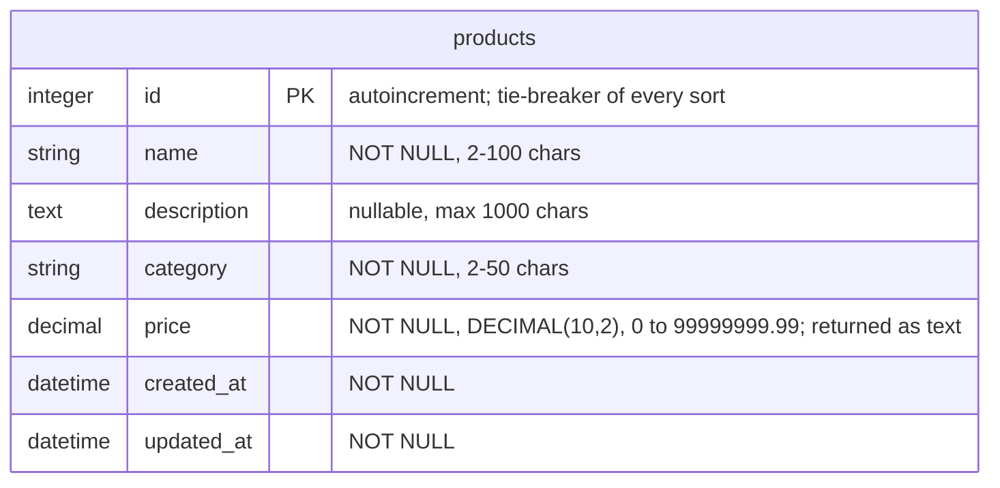
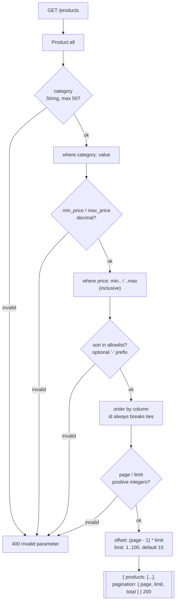

# Product — Queries

Query parameters, filters, sorting, pagination and partial update.

Source: [`app/routes/products_routes.rb`](../../app/routes/products_routes.rb) · [`app/models/product.rb`](../../app/models/product.rb) · [`db/migrate/20261001120001_create_products.rb`](../../db/migrate/20261001120001_create_products.rb)

## Schema



`price` is **text on the wire**: sent as a JSON string or number, always
returned as a string (`"159.9"`), so no client ever loses precision to a float.

### Accepted fields

`POST` and `PATCH` accept `name, description, category, price`; `POST` requires
`name`, `category` and `price`. Unknown keys are a `400` (`Unknown fields`)
before ActiveRecord sees them.

## Query pipeline

`GET /products` runs the stages below in order; an invalid parameter stops the
request with a `400` naming it.



### Parameters

| Parameter | Type | Default | Rules |
| --- | --- | --- | --- |
| `category` | text | — | Exact match; at most 50 characters |
| `min_price` | decimal | — | Inclusive lower bound; a decimal number (`10`, `10.5`, `.5`, `-3`) |
| `max_price` | decimal | — | Inclusive upper bound; same format |
| `sort` | string | `id` | One of `id`, `name`, `price`, `category`, `created_at`; a leading `-` means descending (`-price`) |
| `page` | integer | `1` | Positive integer, 1-based |
| `limit` | integer | `10` | Positive integer, at most `100` (`MAX_LIMIT`) |

- Sorting always adds `id`, so pages are **stable** — walking them never
  skips nor repeats a record.
- `pagination.total` is the count **after** filters and **before** offset/limit.

## Routes

| Method | Path | Success | Notes |
| --- | --- | --- | --- |
| `GET` | `/products` | `200` | `{ "products": [...], "pagination": { page, limit, total } }` |
| `GET` | `/products/:id` | `200` | `{ "product": {...} }` |
| `POST` | `/products` | `201` | `Location: /products/:id` |
| `PATCH` | `/products/:id` | `200` | Only the sent fields change |

Entity-specific code beyond the shared ones (defined in
[errors.md](../errors.md)): none — every response here is shared.

## Examples

### List with filter, sorting and pagination

```http
GET /products?category=peripherals&min_price=10&sort=-price&page=2&limit=5
```

```http
HTTP/1.1 200 OK
Content-Type: application/json

{
  "products": [
    {
      "id": 8,
      "name": "Keyboard",
      "description": "nice",
      "category": "peripherals",
      "price": "159.9",
      "created_at": "2026-10-03T21:22:40.938Z",
      "updated_at": "2026-10-03T21:22:40.938Z"
    }
  ],
  "pagination": { "page": 2, "limit": 5, "total": 42 }
}
```

### Create

```http
POST /products
Content-Type: application/json

{ "name": "Keyboard", "category": "peripherals", "price": "159.9" }
```

```http
HTTP/1.1 201 Created
Location: /products/8
Content-Type: application/json

{ "product": { "id": 8, "name": "Keyboard", "description": null, "category": "peripherals", "price": "159.9", "created_at": "2026-10-03T21:22:40.938Z", "updated_at": "2026-10-03T21:22:40.938Z" } }
```

### Partial update

```http
PATCH /products/8
Content-Type: application/json

{ "price": "149.9" }
```

Only `price` changes; `updated_at` is refreshed.

### Invalid parameter

```http
GET /products?sort=stock
```

```http
HTTP/1.1 400 Bad Request
Content-Type: application/json

{
  "error": "Invalid parameter",
  "messages": ["sort must be one of: id, name, price, category, created_at"]
}
```

## Notes

- An unknown `sort` column is a `400`, never silently ignored — the allowlist
  (`PRODUCT_SORT_COLUMNS`) keeps column names out of the query unchecked.
