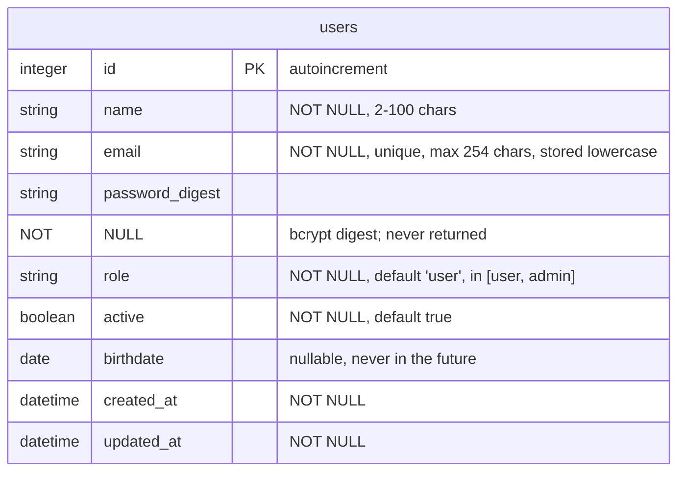
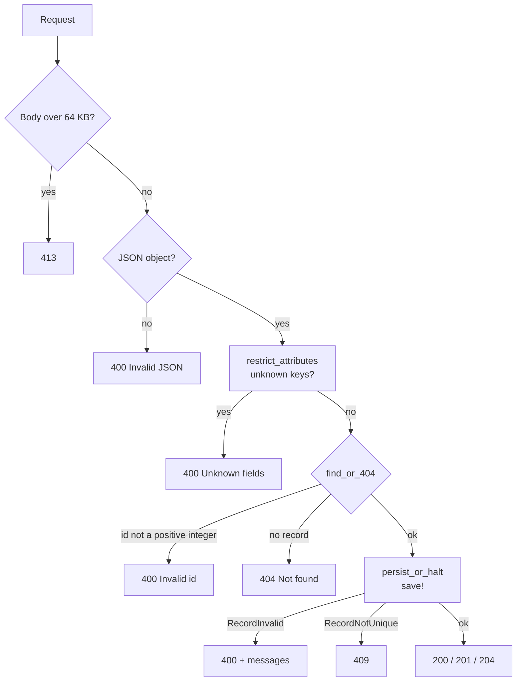

# User — CRUD & Fundamentals

CRUD, route parameters, JSON, status codes, validation and persistence.

Source: [`app/routes/users_routes.rb`](../../app/routes/users_routes.rb) · [`app/models/user.rb`](../../app/models/user.rb) · [`db/migrate/20261001120000_create_users.rb`](../../db/migrate/20261001120000_create_users.rb)

## Schema



## Rules beyond the schema

- **Email normalization** — stripped and lowercased in `before_validation`, so
  `Ada@Example.COM` and `ada@example.com` are the same address. Uniqueness is
  enforced twice: model validation (`400`) and the unique index (`409` when two
  requests race).
- **Virtual attributes** — `password` (min 8 chars; required on create,
  optional on update) and `password_confirmation` (must match when sent) have
  no column; only the bcrypt digest is stored.
- **Response allowlist** — `as_json` exposes `id, name, email, role, active,
  birthdate, created_at, updated_at`; `password_digest` never appears in a
  response.
- **Birthdate** — must be a real `YYYY-MM-DD` date (ActiveRecord would silently
  cast garbage to `nil`), never in the future.

### Accepted fields

`POST`, `PUT` and `PATCH` accept `name, email, password, password_confirmation,
role, birthdate, active`. Unknown keys are a `400` (`Unknown fields`) before
ActiveRecord sees them.

## Routes

| Method | Path | Success | Notes |
| --- | --- | --- | --- |
| `GET` | `/users` | `200` | `{ "users": [...] }`, active or not |
| `GET` | `/users/:id` | `200` | `{ "user": {...} }` |
| `POST` | `/users` | `201` | `Location: /users/:id` |
| `PUT` | `/users/:id` | `200` | Full replacement: `name`, `email` and `role` required; `password` may be omitted. Repeatable, same state |
| `PATCH` | `/users/:id` | `200` | Only the sent fields change; empty body is a no-op |
| `DELETE` | `/users/:id` | `204` | Empty body |

## Request flow

Every write goes through the same pipeline; a `409` here means the email lost a
uniqueness race.



The shared responses (`400`, `404`, `405`, `413`) are defined once in
[errors.md](../errors.md).

## Examples

### Create

```http
POST /users
Content-Type: application/json

{
  "name": "Ada Lovelace",
  "email": "  Ada@Example.COM ",
  "password": "secret123",
  "password_confirmation": "secret123",
  "role": "admin",
  "birthdate": "1815-12-10"
}
```

```http
HTTP/1.1 201 Created
Location: /users/8
Content-Type: application/json

{
  "user": {
    "id": 8,
    "name": "Ada Lovelace",
    "email": "ada@example.com",
    "role": "admin",
    "active": true,
    "birthdate": "1815-12-10",
    "created_at": "2026-10-03T21:22:40.880Z",
    "updated_at": "2026-10-03T21:22:40.880Z"
  }
}
```

The email arrives with spaces and mixed case; it is stored normalized.

### Replace vs partial update

```http
PUT /users/8
Content-Type: application/json

{ "name": "Ada L.", "email": "ada@example.com", "role": "user" }
```

PUT replaces: a missing `name`, `email` or `role` is a `400` (the route forces
them to `nil` and validation rejects it). Repeating the same PUT is a no-op.

```http
PATCH /users/8
Content-Type: application/json

{ "active": false }
```

PATCH only touches `active`.

### Validation failure

```http
HTTP/1.1 400 Bad Request
Content-Type: application/json

{
  "error": "Validation failed",
  "messages": [
    "Password is too short (minimum is 8 characters)",
    "Birthdate must be a valid date in YYYY-MM-DD format"
  ]
}
```

## Notes

- `GET /users` returns **every** user, active or not — deactivation is not a
  filter here.
- `DELETE` answers `204` with an empty body.
